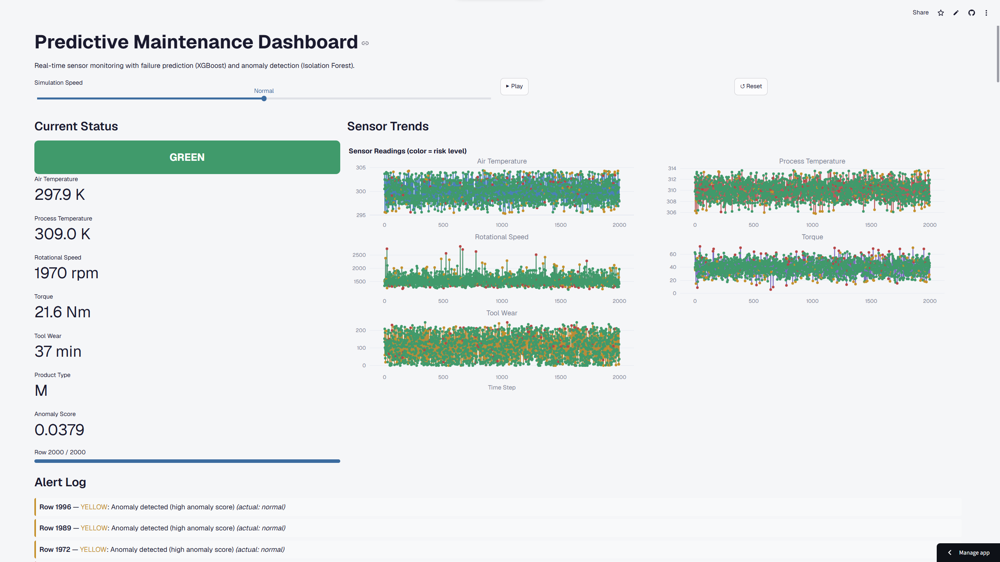
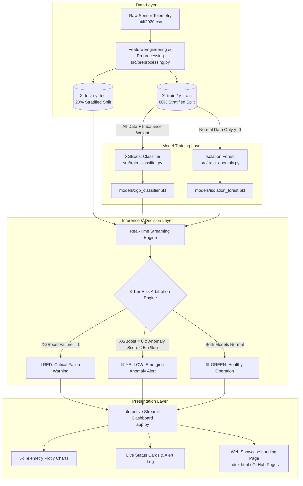
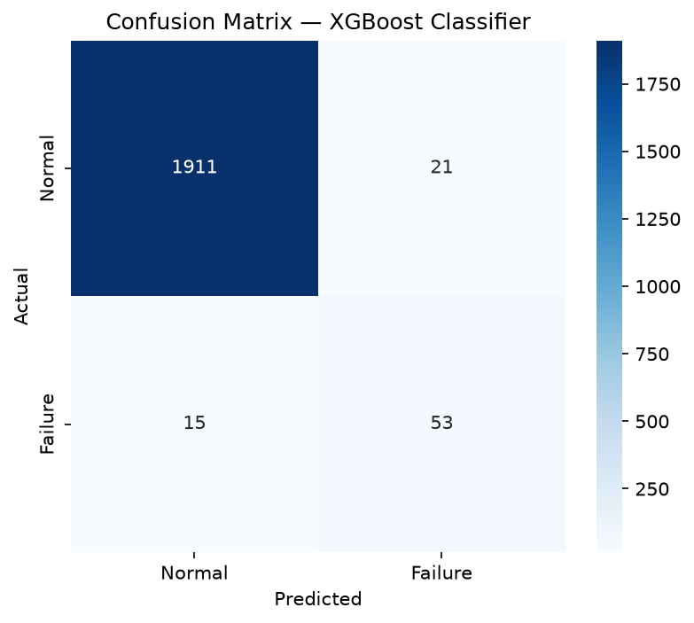

# ⚡ Industrial Predictive Maintenance & Anomaly Detection

[](https://hoseki7-predictive-maintenance.streamlit.app/)
[](https://hoseki7.github.io/predictive-maintenance-ml/)
[](https://www.python.org/)
[](LICENSE)

> **An End-to-End Dual-Layer Machine Learning Early Warning System for Industrial Equipment Failure Classification and Zero-Day Anomaly Detection.**

---

## 📌 Table of Contents

- [Overview & Problem Statement](#-overview--problem-statement)
- [Key Features](#-key-features)
- [System Architecture](#-system-architecture)
- [Dataset & Physical Domain Context](#-dataset--physical-domain-context)
- [Machine Learning Methodology](#-machine-learning-methodology)
- [Experimental Results & Evaluation](#-experimental-results--evaluation)
- [Interactive Dashboard & Showcase](#-interactive-dashboard--showcase)
- [Repository Structure](#-repository-structure)
- [Getting Started & Installation](#-getting-started--installation)
- [Deployment](#-deployment)
- [Engineering Limitations & Transparency](#-engineering-limitations--transparency)
- [Future Roadmap](#-future-roadmap)
- [License](#-license)

---

## 🎯 Overview & Problem Statement

In industrial manufacturing, power transmission, and automated production facilities (e.g., CNC milling, electrical drives, hydraulic pumps), **unplanned equipment downtime** is one of the single highest operational costs. Unexpected machine failure halts assembly lines, causes emergency repair expenses, and damages downstream equipment.

Traditional maintenance approaches fall into two extremes:
1. **Reactive Maintenance (Run-to-Failure):** Repair only after breakdown occurs — leading to catastrophic downtime.
2. **Preventive Maintenance (Time-Based):** Replace components on a fixed schedule regardless of actual wear — leading to premature part replacement and wasted budget.

### The Solution: Dual-Layer Predictive Maintenance

This project implements an intelligent, real-time **Predictive Maintenance & Early Warning System** using sensor telemetry. Rather than relying on a single model, this system introduces a **Two-Layer Hybrid Detection Architecture**:

1. **Layer 1 — Supervised Failure Classification (XGBoost):** Recognizes known, historical failure patterns with cost-sensitive weighting to handle severe class imbalance (~3.4% failure rate).
2. **Layer 2 — Unsupervised Anomaly Detection (Isolation Forest):** Trained exclusively on healthy operational data to detect subtle sensor drift, emerging degradation, and zero-day anomalies that have never been labeled before.

A **3-Tier Decision Engine** arbitrates model predictions into actionable risk states (**🟢 Green**, **🟡 Yellow**, **🔴 Red**), providing maintenance teams with an intuitive early warning dashboard.



---

## ✨ Key Features

- **🛡️ Two-Layer Hybrid Detection:** Combines the high precision of supervised gradient boosting with the out-of-distribution detection capabilities of unsupervised isolation trees.
- **⚖️ Imbalance-Aware Training:** Dynamically handles severe minority class imbalance ($\approx 3.39\%$ failure rate) using `scale_pos_weight = 28.5` and stratified splits.
- **🚦 3-Tier Risk Arbitration Engine:**
  - **🟢 Healthy:** Both models confirm normal operation.
  - **🟡 Warning / Anomaly:** Classifier predicts normal, but unsupervised Isolation Forest flags abnormal telemetry ($\le 5\text{th}$ percentile threshold) — providing early warning before failure occurs.
  - **🔴 Critical / Failure:** Supervised classifier detects an imminent, known failure signature.
- **📈 Real-Time Sensor Telemetry Simulation:** Interactive Streamlit dashboard replaying multi-sensor industrial data with 5 synchronized Plotly time-series graphs.
- **📝 Live Alert Dispatch & Ground-Truth Verification:** Streaming alert log with severity tags and verification against actual ground-truth machine states.
- **📦 Modular & Reproducible Pipeline:** Clean separation of data loading, preprocessing, model training, evaluation, and visualization modules with Parquet serialization.

---

## 🏗️ System Architecture

The end-to-end data and inference flow is structured as follows:



---

## 📊 Dataset & Physical Domain Context

The project utilizes the **AI4I 2020 Predictive Maintenance Dataset** (UCI Machine Learning Repository / Matan et al.), reflecting 10,000 operational cycles of an industrial milling machine.

### Telemetry Features

| Feature Name | Column in Code | Physical Unit | Operating Range | Domain Significance |
|:---|:---|:---:|:---:|:---|
| **Air Temperature** | `air_temperature_k` | Kelvin ($K$) | $295.3 - 304.5$ | Ambient room/factory operating temperature. |
| **Process Temperature** | `process_temperature_k` | Kelvin ($K$) | $305.7 - 313.8$ | Internal generated process temperature ($\ge \text{Air Temp}$). |
| **Rotational Speed** | `rotational_speed_rpm` | RPM ($rpm$) | $1168 - 2886$ | Spindle / motor shaft angular velocity. |
| **Torque** | `torque_nm` | Newton-meter ($Nm$) | $3.8 - 76.6$ | Mechanical shaft load and proxy for electrical motor stress. |
| **Tool Wear** | `tool_wear_min` | Minutes ($min$) | $0 - 253$ | Cumulative cutting time of the active tool insert. |
| **Product Type** | `Type` | Categorical | `L` (50%), `M` (30%), `H` (20%) | Product quality variants affecting stress thresholds ($L=0, M=1, H=2$). |

### 5 Physical Failure Modes in the Dataset

1. **Tool Wear Failure (TWF):** Tool insert exceeds operational lifespan limit ($200 - 240\text{ min}$) causing friction breakdown.
2. **Heat Dissipation Failure (HDF):** Thermal dissipation collapses when process-to-air temperature difference $\Delta T < 8.6\text{ K}$ and rotational speed $< 1380\text{ rpm}$.
3. **Power Failure (PWF):** Mechanical power $P = \tau \cdot \omega$ exceeds safe power envelope ($P < 3500\text{ W}$ or $P > 9000\text{ W}$).
4. **Overstrain Failure (OSF):** Product of tool wear and torque exceeds structural threshold ($L: 11,000$, $M: 12,000$, $H: 13,000\text{ min}\cdot Nm$).
5. **Random Failure (RNF):** Stochastic component failure occurring with a constant probability of $0.1\%$.

**Class Imbalance:** Out of 10,000 samples, only **339 failures** occur ($\approx 3.39\%$), accurately mirroring real-world industrial machinery reliability where failures are rare but catastrophic.

---

## 🧠 Machine Learning Methodology

### 1. Layer 1 — Supervised Failure Classifier (XGBoost)
- **Objective:** High-confidence classification of known failure signatures.
- **Handling Imbalance:** Extreme class imbalance is compensated using `scale_pos_weight = N_neg / N_pos \approx 28.5`, penalizing missed failure errors during gradient boosting loss calculation.
- **Hyperparameters:**
  - `n_estimators`: 200
  - `max_depth`: 6
  - `learning_rate`: 0.1
  - `eval_metric`: `"logloss"`
  - `random_state`: 42

### 2. Layer 2 — Unsupervised Anomaly Detector (Isolation Forest)
- **Objective:** Detect novel failure signatures, sensor calibration drift, and unmodeled mechanical stresses.
- **Training Strategy:** Trained **strictly on healthy operational data** (`Machine failure == 0`).
- **Mechanism:** Isolates unusual observations using recursive binary partitioning; anomalies require significantly shorter average tree path lengths.
- **Threshold Calibration:** Anomaly score threshold is calibrated to the **5th percentile** of the healthy training distribution.

### 3. 3-Tier Risk Fusion Engine

| Status | Condition | Meaning & Recommended Action |
|:---:|:---|:---|
| 🔴 **RED** | `y_xgb == 1` | **Critical Failure Imminent.** Halt machine; immediate maintenance dispatch required. |
| 🟡 **YELLOW** | `y_xgb == 0` AND `anomaly_score <= threshold` | **Emerging Anomaly / Drift Detected.** Sensor pattern is abnormal. Schedule non-urgent inspection. |
| 🟢 **GREEN** | `y_xgb == 0` AND `anomaly_score > threshold` | **Healthy Operation.** Machine running within normal operating parameters. |

---

## 🔬 Experimental Results & Evaluation

The models were evaluated on a held-out **20% Stratified Test Set (2,000 samples: 1,932 Normal, 68 Failures)**.

### Classification Performance (XGBoost on Test Set)

| Class | Precision | Recall | F1-Score | Support |
|:---|:---:|:---:|:---:|:---:|
| **Normal (0)** | 0.99 | 0.99 | 0.99 | 1,932 |
| **Machine Failure (1)** | **0.72** | **0.78** | **0.75** | **68** |
| **Macro Average** | 0.85 | 0.88 | 0.87 | 2,000 |
| **Weighted Average** | 0.98 | 0.98 | 0.98 | 2,000 |
| **Overall Accuracy** | — | — | **0.98 (98.2%)** | 2,000 |

### Confusion Matrix Breakdown

<div align="center">
  
</div>

| | Predicted Normal | Predicted Failure | Total Actual |
|:---|:---:|:---:|:---:|
| **Actual Normal** | **1,911** (True Negative) | **21** (False Positive) | 1,932 |
| **Actual Failure** | **15** (False Negative) | **53** (True Positive) | 68 |

### Why Failure Recall (78%) is Prioritized
In industrial maintenance, the cost asymmetry is severe:
- **Cost of False Positive (21 cases, 1.0% false alarm rate):** A technician spends 10 minutes inspecting a functioning machine.
- **Cost of False Negative (15 missed cases):** A high-speed spindle seized mid-production, damaging tooling and causing hours of assembly line stoppage costing thousands of dollars.

By tuning the decision boundary and `scale_pos_weight`, the system prioritizes high **Recall (78%)** while maintaining high **Precision (72%)** and overall **Accuracy (98.2%)**.

### Test Set Risk Distribution
- 🟢 **Healthy (Green):** 1,841 / 2,000 (92.1%)
- 🟡 **Warning / Anomaly (Yellow):** 85 / 2,000 (4.2%)
- 🔴 **Critical Failure (Red):** 74 / 2,000 (3.7%)

---

## 🖥️ Interactive Dashboard & Showcase

### 1. Streamlit Live Monitoring Dashboard (`app.py`)
- **Simulation Playback:** Replays test telemetry row-by-row with selectable simulation speed (*Slow: 0.5s, Normal: 0.2s, Fast: 0.05s*), Play, Pause, and Reset controls.
- **Multi-Sensor Telemetry Plots:** 5 synchronized Plotly charts (Air Temp, Process Temp, Rotational Speed, Torque, Tool Wear) with dynamically colored risk markers.
- **Real-Time Alert Feed:** Chronological alert table highlighting timestamps, risk severity, diagnostic reasoning, and ground-truth validation.
- **Status HUD:** Current risk badge, live scalar sensor readouts, and simulation progress indicator.

### 2. Modern Web Showcase (`index.html`)
- High-performance, dark-themed responsive portfolio page built with **Tailwind CSS** and **Geist typography**.
- Includes live performance metric cards, interactive model comparison, interactive architecture breakdown, and one-click access to the live dashboard.

---

## 📁 Repository Structure

```
predictive-maintenance-ml/
├── app.py                      # Interactive Streamlit monitoring dashboard
├── index.html                  # High-performance web showcase landing page
├── requirements.txt            # Python dependencies
├── LICENSE                     # MIT License
├── README.md                   # Comprehensive project documentation
│
├── src/                        # Modular source code
│   ├── __init__.py
│   ├── data_loader.py          # Parquet and CSV I/O utilities
│   ├── preprocessing.py        # Feature engineering, type encoding, stratified splitting
│   ├── train_classifier.py     # XGBoost supervised classifier training pipeline
│   ├── train_anomaly.py        # Isolation Forest unsupervised training pipeline
│   └── evaluate.py             # Model evaluation suite, metrics, and confusion matrix generator
│
├── data/                       # Datasets
│   ├── ai4i2020.csv            # Raw AI4I 2020 dataset (10,000 rows)
│   └── processed/              # Parquet splits (X_train, X_test, y_train, y_test, test_data)
│
├── models/                     # Serialized trained model artifacts
│   ├── xgb_classifier.pkl      # Pre-trained XGBoost model
│   └── isolation_forest.pkl    # Pre-trained Isolation Forest model
│
├── reports/                    # Evaluation artifacts and outputs
│   ├── confusion_matrix.png    # High-resolution confusion matrix plot
│   └── test_predictions.csv   # Test set predictions with risk levels
│
├── notebooks/                  # Jupyter notebooks for research & exploration
│   └── 01_eda.ipynb            # Exploratory Data Analysis, distributions & correlations
│
├── assets/                     # Visual assets
│   └── dashboard_preview.png   # Dashboard UI preview screenshot
│
├── docs/                       # Project specifications
│   └── PRD-predictive-maintenance.md # Product Requirement Document (PRD)
│
└── .streamlit/
    └── config.toml             # Custom Streamlit UI styling & theme configuration
```

---

## 🚀 Getting Started & Installation

### Prerequisites
- Python `3.10`, `3.11`, `3.12`, or `3.13`
- Git

### 1. Clone the Repository
```bash
git clone https://github.com/HOSEKI7/predictive-maintenance-ml.git
cd predictive-maintenance-ml
```

### 2. Create and Activate a Virtual Environment

**Windows (PowerShell):**
```powershell
python -m venv venv
.\venv\Scripts\Activate.ps1
```

**Linux / macOS:**
```bash
python3 -m venv venv
source venv/bin/activate
```

### 3. Install Dependencies
```bash
pip install --upgrade pip
pip install -r requirements.txt
```

### 4. Reproduce Data Preprocessing & Training *(Optional — Pretrained Models Included)*
```bash
# 1. Preprocess raw data and create train/test parquet splits
python -m src.preprocessing

# 2. Train XGBoost supervised failure classifier
python -m src.train_classifier

# 3. Train Isolation Forest unsupervised anomaly detector
python -m src.train_anomaly

# 4. Run evaluation suite and generate metrics report + confusion matrix
python -m src.evaluate
```

### 5. Launch the Streamlit Monitoring Dashboard
```bash
streamlit run app.py
```
*The dashboard will automatically open in your default browser at `http://localhost:8501`.*

### 6. View Web Showcase
Open `index.html` directly in any web browser or serve it via Python:
```bash
python -m http.server 8000
```
Then visit `http://localhost:8000`.

---

## ☁️ Deployment

### Streamlit Community Cloud (Zero-Config)
This repository is pre-configured for direct continuous deployment on **Streamlit Community Cloud**:
1. Fork or push this repository to GitHub.
2. Visit [share.streamlit.io](https://share.streamlit.io/) and log in with GitHub.
3. Click **New App**, select this repository, branch `main`, and set **Main file path** to `app.py`.
4. Click **Deploy**. Dependencies from `requirements.txt` and `.streamlit/config.toml` themes are detected automatically.

---

## 🔍 Engineering Limitations & Transparency

In the spirit of technical rigor and honest engineering documentation:
- **Simulated Sensor Telemetry:** The dataset is generated from physical models rather than raw physical vibration accelerometers.
- **Proxy Electrical Stress:** `Torque [Nm]` and `Rotational Speed [rpm]` are utilized as physical proxies for motor load and electrical strain in the absence of raw three-phase current waveforms.
- **Single-Machine Domain:** Telemetry represents a single industrial milling machine process environment; fleet-wide generalization would require domain adaptation across varied equipment topologies.

---

## 🔮 Future Roadmap

- [ ] **Real-Time IoT Ingestion:** Connect live industrial streaming protocols (MQTT, OPC-UA, Modbus TCP) to feed incoming telemetry directly into the inference loop.
- [ ] **Time-Series Deep Learning:** Implement bidirectional LSTM Autoencoders and Temporal Fusion Transformers (TFT) to model multi-step sequential dependencies.
- [ ] **Edge ML Optimization:** Export XGBoost and Isolation Forest pipelines to **ONNX Runtime** and **TensorRT** for low-latency microsecond inference on embedded edge devices (e.g., Raspberry Pi, NVIDIA Jetson).
- [ ] **Root-Cause Explainability:** Integrate SHAP (SHapley Additive exPlanations) waterfall plots directly inside the Streamlit HUD to explain *why* a specific failure mode was triggered.

---

## 📄 License

Distributed under the **MIT License**. See [`LICENSE`](LICENSE) for more information.

---

<div align="center">
  <sub>Built with ❤️ by <b>HOSEKI</b> · Machine Learning & Industrial AI Engineering Portfolio</sub>
</div>
